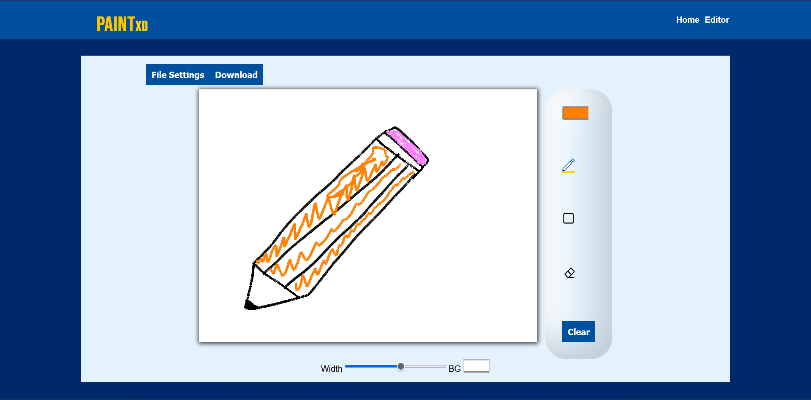
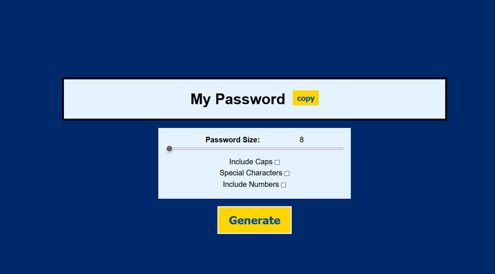
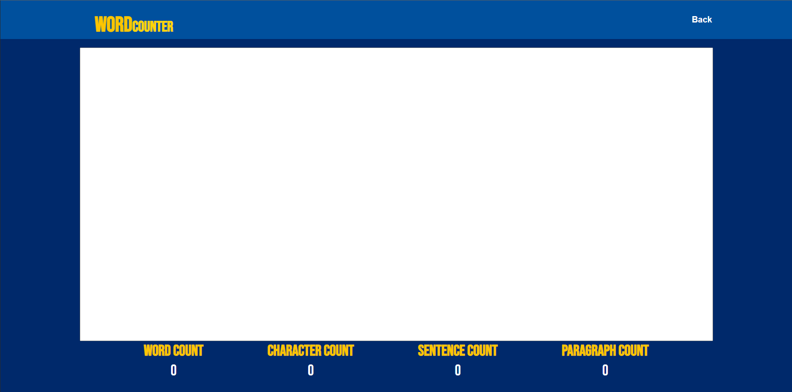

# jsJunction

Welcome to jsJunction, an old-school UI website featuring a collection of simple frontend tools built with vanilla JavaScript. This repository showcases various tools available on the website and serves as a learning resource for individuals interested in developing similar applications.

## Website Overview

Explore a range of tools accessible through the website's straightforward design. Each tool comes with its own set of features, offering utility for different purposes.

### Tools Available:

#### 1. PaintXD

- **Description:** A drawing tool designed to inspire creativity and bring imagination to life.
- **Features:**
  - Pencil tool for sketching and drawing with precision.
  - Color picker with an extensive palette.
  - Eraser for easy corrections.
  - Resolution adjustment for canvas customization.
  - Image importing and exporting capabilities.
- [Use PaintXD Tool](./apps/PaintXD.html)

#### 2. Password Generator

- **Description:** Create strong, secure passwords tailored to your specifications.
- **Features:**
  - Custom password generation for maximum security.
  - Control over password length.
  - Variety of characters included for diversity.
  - Clipboard integration for easy copying.
- [Use Password Generator Tool](./apps/passwordGen.html)

#### 3. Decision Maker

- **Description:** Simplifies decision-making by randomly selecting from a list of options.
- **Features:**
  - Input variety for multiple options.
  - Quick random selection with a single click.
  - User-friendly interface for easy use.
  - Ensures fairness and impartiality in selections.
- [Use Decision Maker Tool](./apps/roulette.html)

#### 4. Word Counter

- **Description:** Provides instant insights into text with word, character, sentence, and paragraph counts.
- **Features:**
  - Accurate word count measurement.
  - Character, sentence, and paragraph count analysis.
  - Immediate insights into text composition.
- [Use Word Counter Tool](./apps/wordCounter.html)

#### 5. Notes App

- **Description:** Simplifies note-taking, allowing effortless management of ideas, thoughts, and tasks.
- **Features:**
  - Easy note saving, updating, and deletion.
  - Organized interface for seamless note management.
  - Ideal for students, professionals, and note-keeping enthusiasts.
- [Use Notes App Tool](./apps/noteApp.html)

## Usage
Explore the individual tools by accessing their respective links. Feel free to examine the codebase to understand how these simple frontend tools were developed using vanilla JavaScript.

Thank you for visiting jsJunction!

